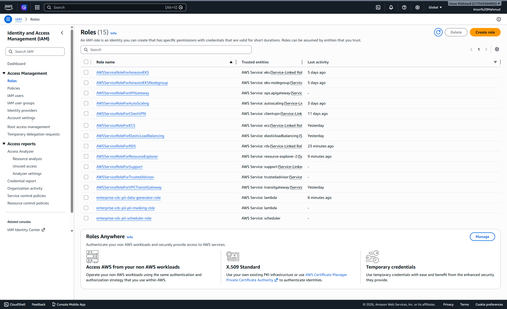
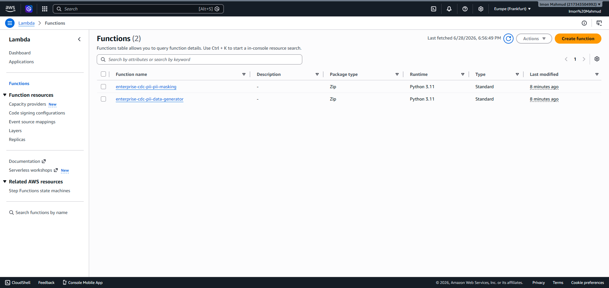
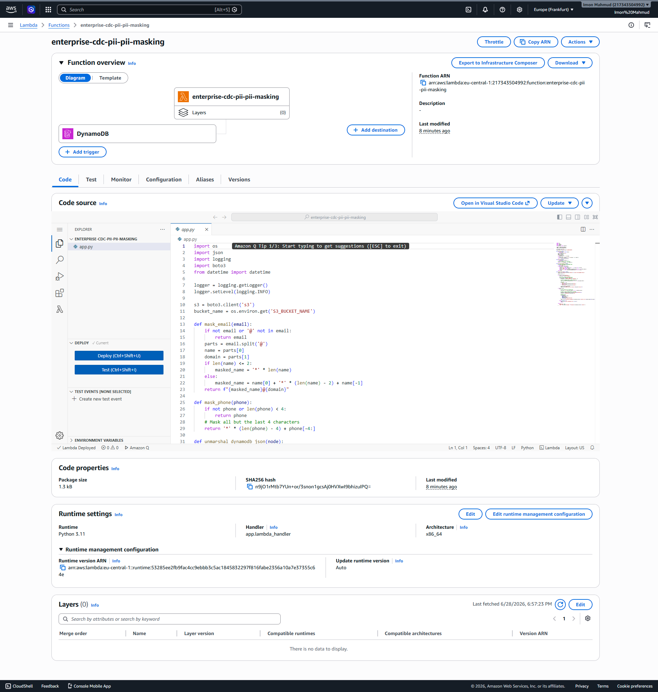
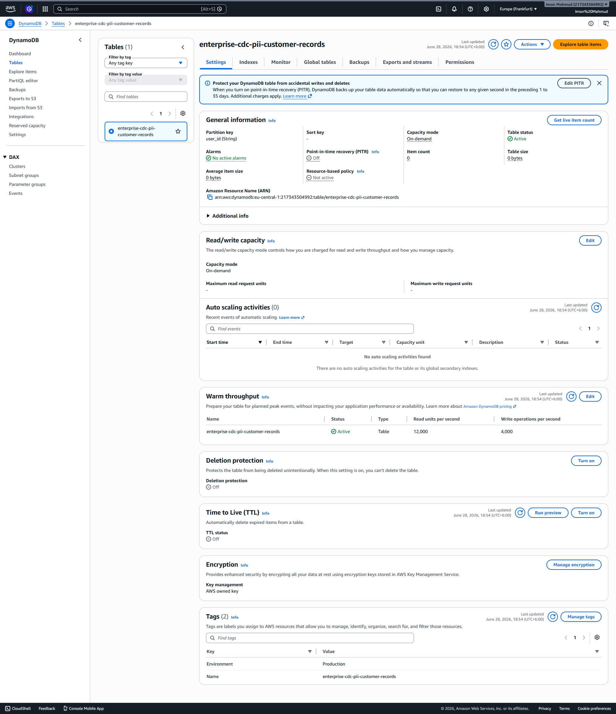

# Enterprise Event-Driven CDC & Automated PII Data Masking Pipeline


## Project Overview
This project is a production-grade **Event-Driven Change Data Capture (CDC) pipeline** built on AWS. It autonomously ingests streaming data, identifies and masks Personally Identifiable Information (PII) on the fly, and securely archives the sanitized records into a centralized Data Lake.

The architecture emphasizes security, automation, cost-efficiency, and strict adherence to IAM least-privilege principles—all while operating entirely within the AWS Free Tier.

## Business Use Case
Enterprise organizations often collect vast amounts of customer data. Under regulations like GDPR, CCPA, and HIPAA, storing raw PII in downstream analytics environments (Data Lakes, Data Warehouses) introduces severe compliance risks.

This solution solves this by:
1. Reacting instantly to database changes (CDC)
2. Automatically scrubbing sensitive fields (Email, Phone Number) before they reach the Data Lake.
3. Enabling downstream Data Science and Analytics teams to work with realistic, sanitized data without compromising customer privacy.

## Key Features
- **Serverless Architecture**: Fully managed, auto-scaling components with zero server maintenance.
- **Real-Time CDC**: Utilizing DynamoDB Streams to capture row-level changes instantaneously.
- **Automated PII Masking**: Python Lambda functions intercept the data stream, apply masking logic (e.g., `j***@example.com`, `+1-***-***-1234`), and forward the clean data.
- **Infrastructure as Code**: 100% automated provisioning and teardown using Terraform.
- **Zero-Touch Synthetic Data**: An automated EventBridge-driven data generator simulates realistic customer traffic.
- **Security First**: Granular IAM roles, encrypted transit, and blocked public S3 access.

## Architecture

### Infrastructure Workflow & Event Flow
1. **AWS EventBridge Scheduler** triggers the **Data Generator Lambda** every minute.
2. The **Data Generator Lambda** synthesizes realistic customer profiles and performs an `INSERT` into the **Amazon DynamoDB Table**.
3. **DynamoDB Streams** instantly captures the change event (CDC).
4. The **PII Masking Lambda** consumes the stream, unmarshals the DynamoDB JSON, and applies masking algorithms to the `email` and `phone` fields.
5. The sanitized JSON record is securely written to the **Amazon S3 Data Lake**, partitioned by timestamp.

### Technology Stack & AWS Services
- **Infrastructure as Code**: HashiCorp Terraform
- **Compute**: AWS Lambda (Python 3.11)
- **Database**: Amazon DynamoDB
- **CDC Streaming**: Amazon DynamoDB Streams
- **Storage**: Amazon S3
- **Event Management**: Amazon EventBridge Scheduler
- **Observability**: Amazon CloudWatch Logs
- **Security**: AWS IAM (Identity and Access Management)

## Folder Structure
```text
.
├── terraform/                # Infrastructure as Code
│   ├── main.tf               # (Combined or separate logic)
│   ├── dynamodb.tf           # DynamoDB Table & Streams
│   ├── eventbridge.tf        # Scheduler setup
│   ├── iam.tf                # Least-privilege roles and policies
│   ├── lambda.tf             # Lambda functions & archiving
│   ├── outputs.tf            # Terraform outputs
│   ├── provider.tf           # AWS Provider config
│   ├── s3.tf                 # S3 Data Lake config
│   └── variables.tf          # Terraform variables
├── src/                      # Source Code
│   ├── data_generator/       # Synthetic data generation logic
│   │   └── app.py
│   └── pii_masking/          # Stream processing & masking logic
│       └── app.py
├── screenshots/              # Execution & Validation proofs
├── .gitignore
└── README.md
```

## PII Masking Example

**Raw Input (DynamoDB):**
```json
{
  "user_id": "d2832e17-f922-4390-b38b-ced111cdb769",
  "name": "William Jones",
  "email": "william.jones@example.com",
  "phone": "+1-882-555-8732",
  "signup_date": "2026-06-28T12:50:26.249Z",
  "status": "SUSPENDED"
}
```

**Masked Output (S3 Data Lake):**
```json
{
  "user_id": "d2832e17-f922-4390-b38b-ced111cdb769",
  "name": "William Jones",
  "email": "w***********s@example.com",
  "phone": "***********8732",
  "signup_date": "2026-06-28T12:50:26.249Z",
  "status": "SUSPENDED"
}
```

## Security Design & IAM Least Privilege
Security is embedded at every layer:
- **Data Generator Lambda**: Only allowed to `dynamodb:PutItem` on the specific table and write to CloudWatch.
- **PII Masking Lambda**: Only allowed to `dynamodb:GetRecords`, `GetShardIterator`, `DescribeStream` on the specific stream ARN, and `s3:PutObject` on the specific bucket.
- **EventBridge Scheduler**: Only allowed to `lambda:InvokeFunction` on the Data Generator Lambda.
- **S3 Bucket**: Block Public Access is strictly enforced.
- **State Security**: `.terraform` directories, state files, and execution outputs are meticulously gitignored.

## Deployment & Validation Steps

1. **Initialize Terraform:**
   ```bash
   cd terraform
   terraform init
   terraform validate
   ```
2. **Deploy Infrastructure:**
   ```bash
   terraform apply -auto-approve
   ```
3. **Automated Testing & Validation:**
   The pipeline begins running immediately. Validation involves checking DynamoDB for new items, ensuring CloudWatch logs show successful processing, and verifying the masked JSON in the S3 bucket.

## Troubleshooting
- **No data in S3?** Check if EventBridge is enabled. Verify the Data Generator Lambda CloudWatch logs for execution errors. Ensure DynamoDB Streams is configured to `NEW_IMAGE`.
- **Terraform errors?** Ensure AWS credentials are valid and the region `eu-central-1` is specified.

## Cleanup Procedure
To prevent ongoing AWS charges and tear down the infrastructure completely:
```bash
terraform destroy -auto-approve
```
*Note: The S3 bucket is configured with `force_destroy = true` for seamless teardown.*

## Future Improvements
- Integrate **Amazon Athena** and **AWS Glue** to query the S3 Data Lake directly.
- Use **AWS KMS** for Customer Managed Keys (CMK) encryption at rest for S3 and DynamoDB.
- Add an SQS Dead Letter Queue (DLQ) for failed stream processing events.

---

## Recruiter Highlights & Screenshot Gallery

This section demonstrates the successful execution and validation of the pipeline in a live AWS environment.

### 1. Amazon EventBridge Scheduler
The scheduler is successfully triggering the pipeline every minute.


### 2. IAM Roles (Least Privilege)
Demonstrates the secure IAM roles created specifically for this project.


### 3. Lambda Functions Overview
Both the Data Generator and the PII Masking functions are deployed.


### 4. Lambda Function (PII Masking) Trigger
DynamoDB Stream is successfully connected as the event source for the masking Lambda.


### 5. DynamoDB Table Configuration
The Customer Records table is provisioned and active.


### 6. DynamoDB Table Items
Synthetic customer data is successfully inserted into the table.


### 7. DynamoDB Streams
Streams are enabled, actively capturing changes (`NEW_IMAGE`).


### 8. CloudWatch Logs
Proof of execution showing the PII Masking Lambda successfully processing stream records and uploading to S3.


### 9. S3 Data Lake (Masked Data)
The masked JSON files are successfully partitioned and stored in the S3 Data Lake.


---

**Author:** Imon Mahmud  
**Professional Title:** IT SPECIALIST | CLOUD INFRASTRUCTURE & AI AUTOMATION ENGINEER
